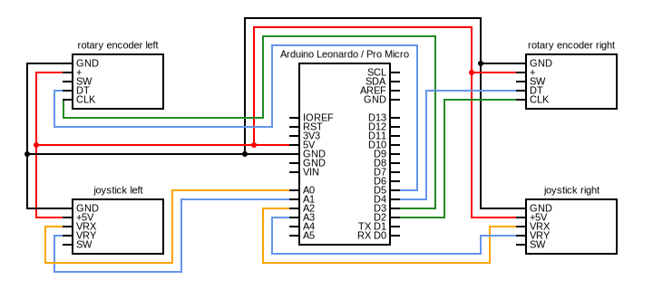

# Turn Indicators
Arduino based turn indicators for use in driving simulators such as Euro Truck Simulator 2 and American Truck Simulator. This program converts joysticks movements into key presses and mimic keyboard in OS.

## Description
This code allows for creating DIY turn indicators using simple joystick components for arduino. in addition two rotary encoders are also supported to allow for "twist buttons". By default the code mimic keyboard presses in OS, but this can be changed to joystick by including arduino joystick library. 

## Hardware
Necessary componets: 
- arduino leonardo / pro micro (must support hdi devices)
- 2x joystick components for arduino
- 2x rotary encoders (needed for "twist buttons")

## Circuit
[Circuit diagram](circuit.svg)

## Notes
Both joystick and rotary encoder components have push buttons that are not supported by code yet.
